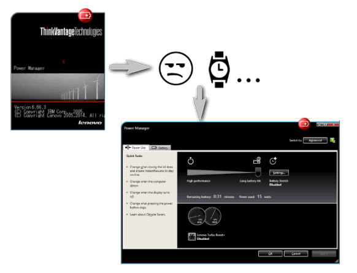

<h1> Lenovo/IBM PowerManager UI Source-Code, C#</h1>

Lenovo's Power Manager (PWMUI, PWMUICtl) is <strong>so very buggy</strong>,
mostly because of the resource-handling of the .Net 2.0/3.0 it uses,

When you update you PC with a newer version of .Net (3.5/4/...)
where the resource-loading is slightly different (on demand/on the fly by default),
it will take the application about 10 minutes (!) to start the main UI.

(A workaround is to start and quickly end the process, resulting with kind of a warm-up..)

This source-code [C#] is reversed engineered for education purposes and bug fix only.
You may help dig-into the code, compile it yourself (it has a generic Visual-Studio project-tree that will work with any version of Visual-Studio).

Here is some more info: <a href="http://icompile.eladkarako.com/solved-lenovo-power-manager-pwmui-exe-slow-start-workaround/"><em>iCompile - </em>Solved: Lenovo Power Manager (PWMUI.EXE) Slow-Start Workaround</a>